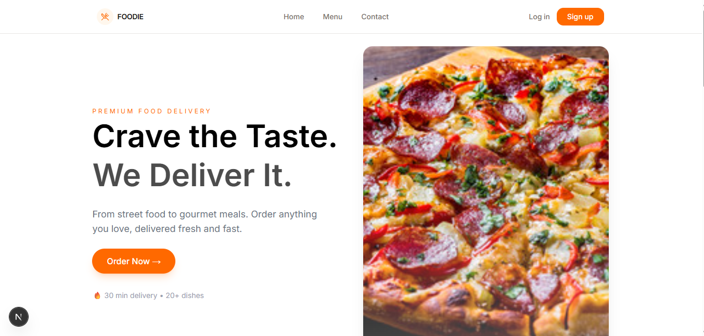
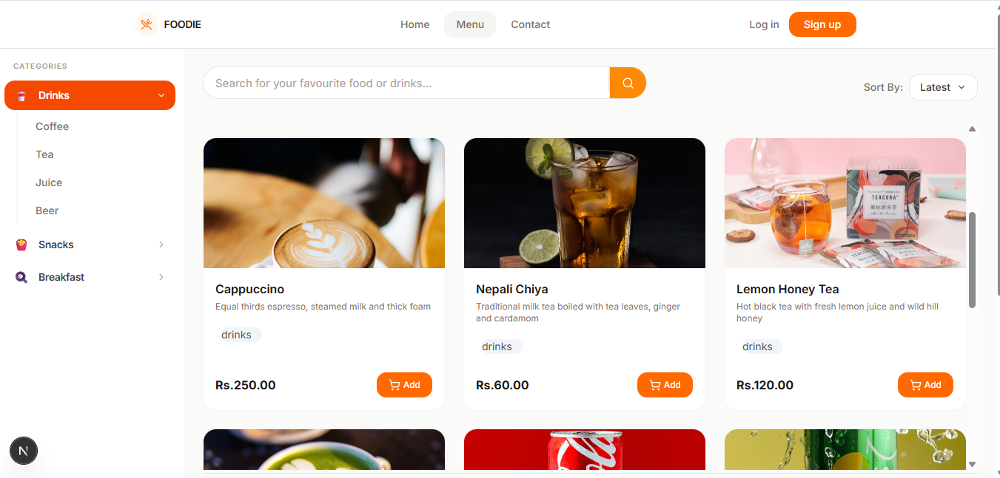
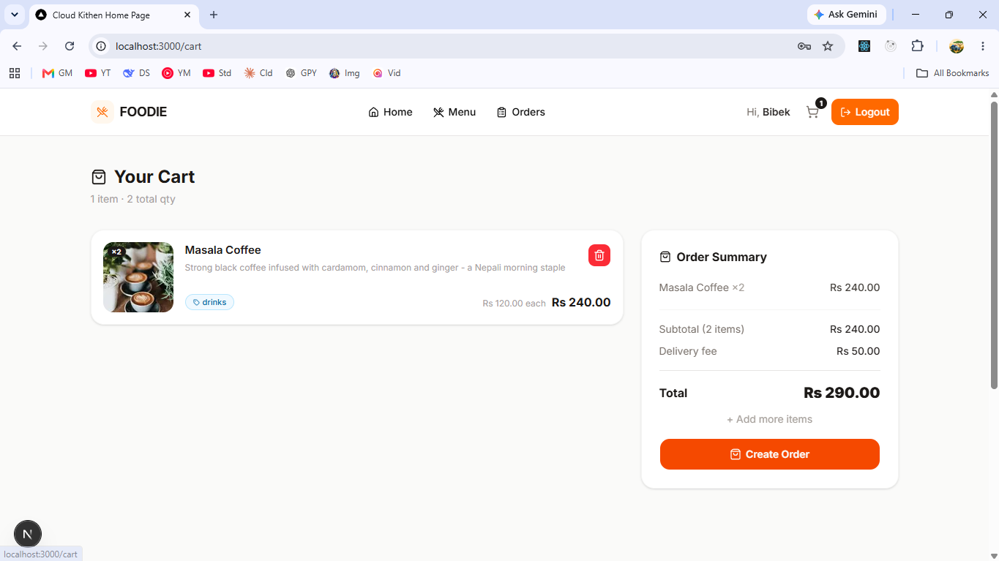
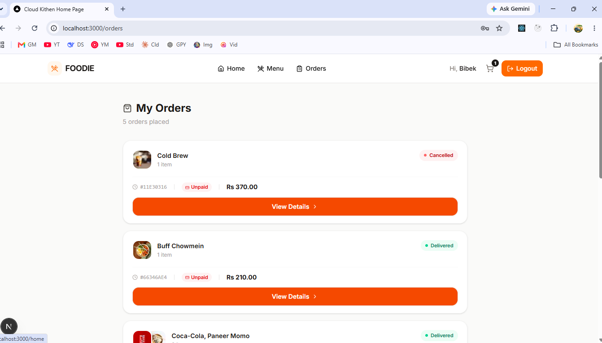
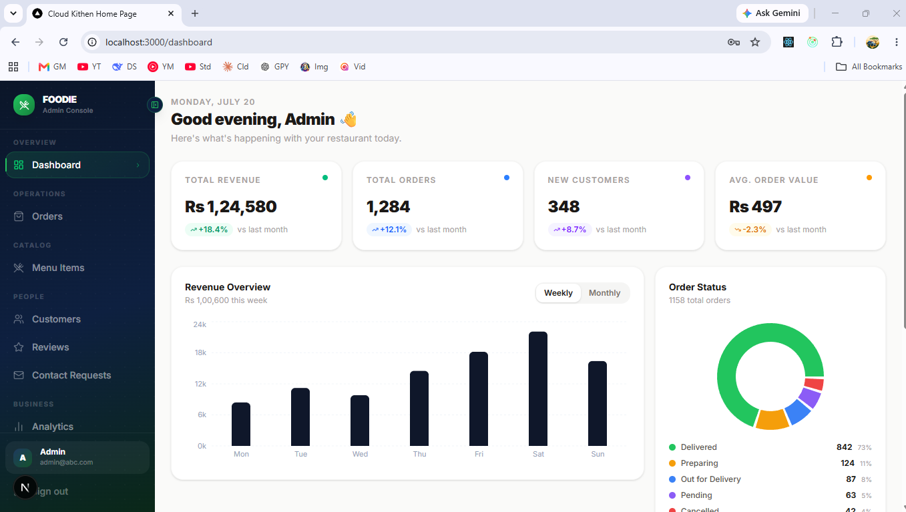
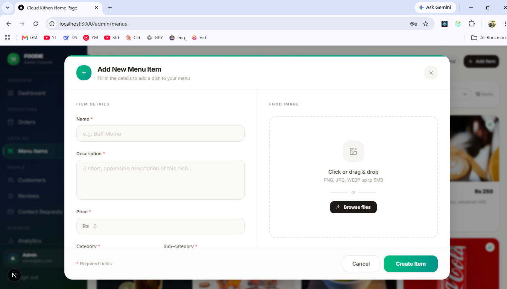
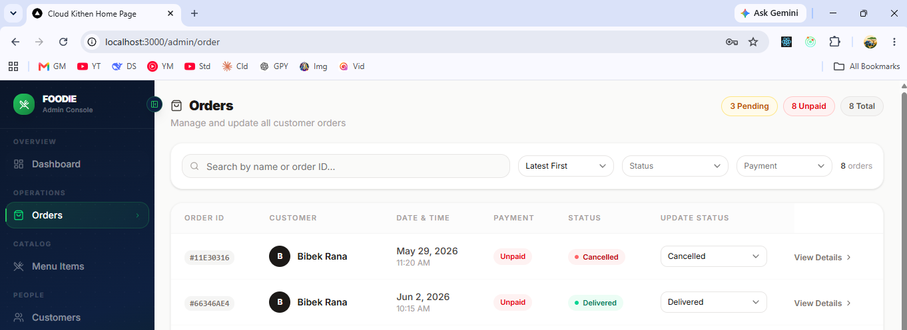
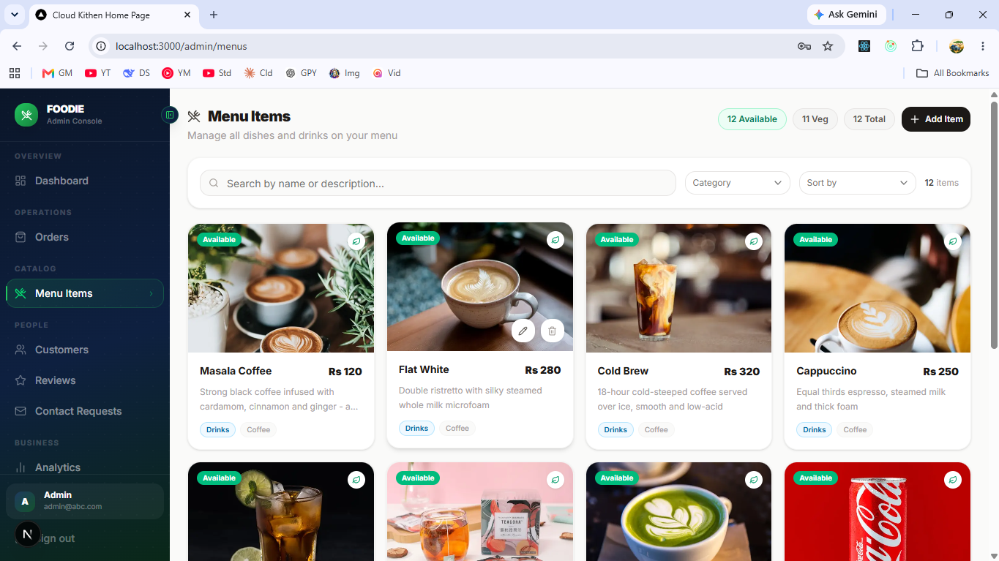

# Restaurant Order Management System

A modern full-stack restaurant ordering platform built with **Next.js**, **Express.js**, and **PostgreSQL**. Customers can browse menu items, add products to their cart, and place orders, while restaurant administrators can manage menu items, process orders, and control platform operations through a dedicated admin dashboard.


## ✨ Features

### Customer Features

* User registration and login
* JWT-based authentication (cookie based)
* Browse restaurant menu
* Add and remove items from cart
* Place orders
* View order history


### Admin Features

* Secure admin dashboard
* Add new food items
* Manage menu items
* Accept or reject customer orders
* Update order status
* Full restaurant management controls

### Security Features

* JWT Authentication
* Role-Based Access Control (RBAC)
* API Rate Limiting
* Request Validation with Zod
* Protected Routes
* Secure Error Handling

---

## 🛠 Tech Stack

### Frontend

* Next.js
* TypeScript
* Tailwind CSS
* Shadcn/UI


### Backend

* Node.js
* Express.js
* PostgreSQL
* Raw SQL Queries
* JWT Authentication
* Zod Validation
* Multer

### Cloud Services

* Cloudinary (Image Storage & Optimization)

### Deployment

* Vercel (Frontend)
* Render (Backend)

---

## 📸 Screenshots

### Home Page



### Menu Page



### Cart Page



### Order Page



---

## 🔐 Admin Panel

### Admin Dashboard



### Add Food Item



### Manage Orders



### Menu CRUD Management



---

## 🏗 Application Workflow

### Customer Journey

```text
Register / Login
        ↓
Browse Menu
        ↓
Add Items To Cart
        ↓
Place Order
        ↓
Track Order Status
```

### Admin Journey

```text
Admin Login
      ↓
Dashboard
      ↓
Manage Menu
      ↓
Accept / Reject Orders
      ↓
Update Order Status
```

---

## 🗄 Database Design

The application uses **PostgreSQL** with **raw SQL queries** for database operations, providing full control over query execution and performance optimization.

Core entities include:

* Users
* Food Items
* Cart Items
* Orders
* Order Items

---

## ☁️ Image Upload System

Food images are uploaded using **Multer** and stored in **Cloudinary**.

```text
Admin Uploads Image
        ↓
      Multer
        ↓
    Cloudinary
        ↓
 Image URL Stored
  In PostgreSQL
        ↓
 Displayed To Users
```

---

## 🧩 Validation & Security

### Validation

* Zod schema validation
* Request payload validation
* API input sanitization

### Security

* JWT Authentication
* Protected Routes
* Role-Based Authorization
* API Rate Limiting
* Secure Error Handling

---

## 📁 Project Structure

```bash
.
├── frontend/
├── backend/
├── screenshots/
│   ├── home.png
│   ├── menu.png
│   ├── cart.png
│   ├── order.png
│   ├── dashboard.png
│   ├── add_item.png
│   ├── manage_orders.png
│   └── crud_menu.png
└── README.md
```

---

## 🎯 Key Technical Highlights

* Next.js App Router Architecture
* Responsive UI with Shadcn/UI and Tailwind CSS
* PostgreSQL Database with Raw SQL Queries
* JWT Authentication & Authorization(cookie and role based)
* Cloudinary Media Management
* Multer File Upload Handling
* Zod Request Validation
* API Rate Limiting
* Role-Based Access Control
* Production Deployment with Vercel and Render

---

## 🚀 Future Improvements

* Online Payment Integration
* Real-Time Order Tracking
* Email Notifications
* Analytics Dashboard
* Docker Support
* CI/CD Pipeline

---

## 👨‍💻 Author

**Klinton Thapa**

GitHub: https://github.com/clin-toon 
LinkedIn: https://www.linkedin.com/in/klinton-thapa/


This project is licensed under the MIT License.
